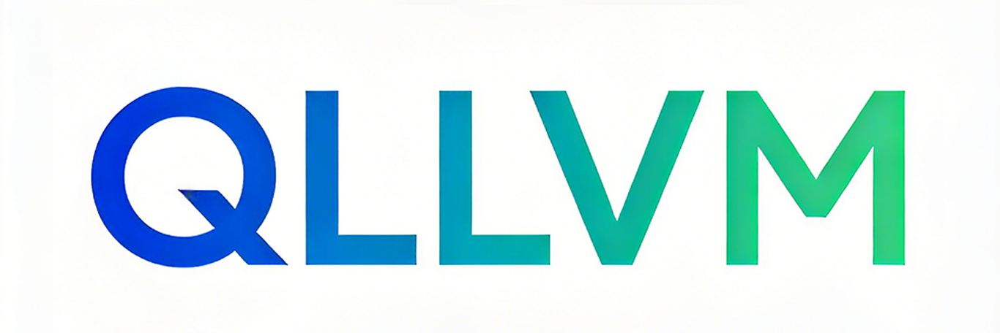
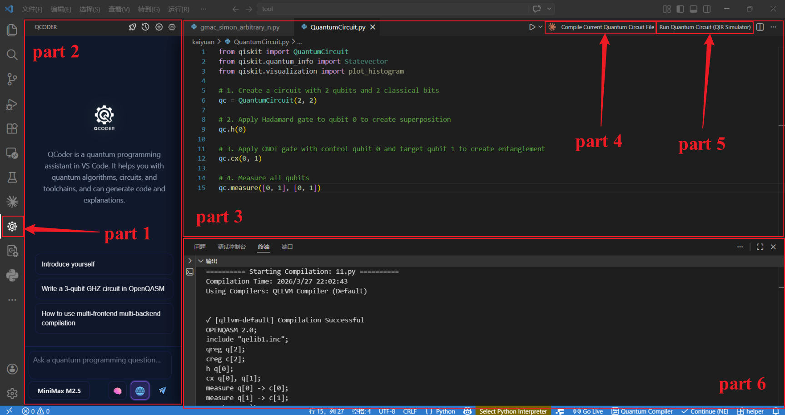

<div align="center">

<!-- 动态渐变背景效果（通过 SVG 实现） -->


## QLLVM 量子编译框架


<p align="center">
  <a href="README.md">English</a> • 
  <a href="README.cn.md">中文</a>
</p>

<p align="center">
  <a href="https://openreview.net/forum?id=5N3z9JQJKq"></a>
  <a href="https://opensource.org/licenses/MIT"></a>
  <a href="https://www.python.org/"></a>
</p>

</div>

---

**QLLVM** 是一个基于 [LLVM](https://llvm.org/) 构建的**经典-量子混合编译框架**，具备卓越的**可扩展性**以及与**经典高性能计算生态**的无缝集成能力。


QLLVM支持多种量子编程语言及后端，所支持的编程语言包括Qiskit、OpenQASM等，目标后端包括qasm模拟器、本源量子计算机、中电信“天衍”量子计算机等。

QLLVM支持量子程序、CUDA程序和经典C++程序的统一编译，为未来经典-量子软件开发提供了高效、灵活且工业级的编译基础设施。

有关如何使用QLLVM的更多细节，请参阅此处的文档:[QLLVM文档](https://qllvm-documentation.readthedocs.io/en/latest/index.html)

***

### 🚀 安装

##### 云端：通过VSCode插件快捷安装，并提供智能编程、编译及运行服务

```bash
1. 下载仓库代码获取插件安装包：
    `./plugin/quantum-circuit-composer-0.1.vsix`
    `./plugin/qcoder-0.1.vsix`
2. 在 VSCode 中打开命令面板（`Ctrl+Shift+P` / `Cmd+Shift+P`）
3. 输入并选择 **Extensions: Install from VSIX...**
4. 依次选择下载的 `.vsix` 文件完成安装
```

##### 本地：从源码安装QLLVM编译器

>请参考 [源码安装文档](https://qllvm-documentation.readthedocs.io/en/latest/installation.html#installation-from-source)

---

### 云端使用
<div align="center">



VScode插件界面展示

</div>


| 区域 | 功能说明 |
|:----:|----------|
| **① Qcoder 侧边栏** | 点击即可使用 Qcoder 智能编程助手 |
| **② Qcoder 主界面** | 智能交互界面 |
| **③ 代码界面** | 用于展示量子程序 |
| **④ 编译键** | 点击即可对代码界面或选中的量子程序进行编译 |
| **⑤ 运行键** | 点击即可运行代码界面或选中的量子程序 |
| **⑥ 输出界面** | 输出编译好的量子线路以及各项参数 |


> 📚 插件详细使用说明请参考 [插件文档](https://qllvm-documentation.readthedocs.io/en/latest/usage.html#using-plugins)

---

### 本地命令行使用

安装完成后，可在命令行使用 `qllvm` 命令编译经典-量子混合程序或纯量子程序。

#### 🔹 编译纯量子程序

```bash
qllvm test/test_bell.qasm -qrt nisq -qpu qasm-backend -O1
```
通过该命令可编译生成test/test_bell_compiled.qasm文件
>📖 完整编译参数说明请参考 [qllvm 使用说明文档](https://qllvm-documentation.readthedocs.io/en/latest/usage.html#compilation-parameter-explanation)

#### 🔹 编译经典-量子混合程序
C++ 程序与 QASM 量子电路混合编译
```bash
qllvm examples/hybrid/main.cpp examples/hybrid/bell.qasm -o hybrid_bell
./hybrid_bell
```
C++ 主程序、CUDA 内核与 QASM 量子电路混合编译，执行需CUDA环境
```bash
cd examples/hybrid_cuda
qllvm main.cpp kernel.cu circuit.qasm -o hybrid_app \
      -cuda-arch sm_75 \
      -cuda-path /usr/local/cuda
qllvm main.cpp kernel.cu circuit.qasm -o hybrid_app -cuda-arch sm_86
./hybrid_app -shots 1024
```

>📖 不同编程语言及后端的详细使用方法，请参考 [使用文档](https://qllvm-documentation.readthedocs.io/en/latest/usage.html)

---

### 📚 QLLVM 文档

QLLVM 的详细说明、安装和使用文档请查阅在线文档：

| 文档 | 说明 |
|------|------|
| 📖 [了解 QLLVM 量子编译框架](https://qllvm-documentation.readthedocs.io/en/latest/introduction.html) | 获取 QLLVM 详细介绍与设计理念 |
| 🔧 [安装 QLLVM 及相关插件](https://qllvm-documentation.readthedocs.io/en/latest/installation.html) | 完整的安装配置指南 |
| 🎓 [学习使用方法](https://qllvm-documentation.readthedocs.io/en/latest/usage.html) | 教程与示例，快速上手 |

---

### 🤝 贡献指南

如果您想为 QLLVM 做贡献，请查阅 [贡献指南](https://qllvm-documentation.readthedocs.io/en/latest/contributing.html)。参与本项目即表示您同意遵守我们的 [行为准则](https://qllvm-documentation.readthedocs.io/en/latest/contributing.html#id2)。

我们使用 [Issues](https://github.com/QCFlow/QLLVM/issues) 进行问题跟踪和功能请求。

---

### 📝 作者与引用

QLLVM 是众多贡献者共同努力的成果。如果您使用了 QLLVM，请参考 [如何贡献](https://qllvm-documentation.readthedocs.io/en/latest/contributing.html#id3) 进行引用。

---

### 📅 更新日志

每个版本的更新日志会在 GitHub Releases 页面动态生成。

---

### 🙏 致谢

本项目基于 **MLIR** 和 **LLVM** 生态构建，感谢开源社区的贡献。同时感谢感谢本源量子、中电信天衍、医图生科、北量院、浙大、弧光量子等单位对本项目的支持。

---

### 📄 许可证

本项目采用 [Aphache2.0](LICENSE) 开源。